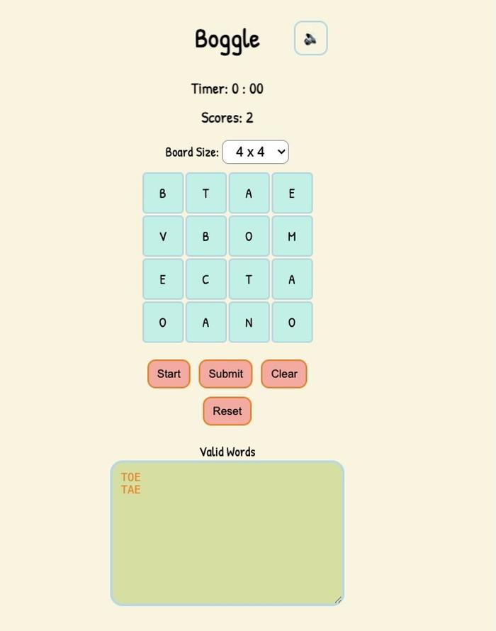
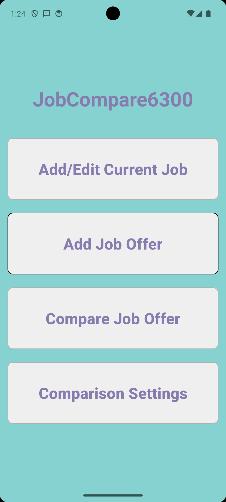

  <h1>Hi there, I'm Shu Wang! 👋</h1>
  
  

  

    Passionate about building clean, scalable, and user-friendly software. 
     
    Currently exploring ideas, building tools, and refining my engineering skills. 🖥️ 🌱
  

  

    
    
    
  

---

### 🛠️ Languages & Tools

  

---

### 🚀 Featured Projects

| Project Preview | Description & Links |
| :---------------------------------------------------- | :----------------------------------------------------------- |
|  | **Portfolio Website** 🌐 A fully responsive personal website showcasing my software engineering and data projects.  🛠 **Tech:** `HTML` `CSS` `JavaScript` `React`  🔗 [**Live Demo**](https://shu-su-wang.vercel.app/)  📂 [**Source Code**](https://github.com/shuwangs/portfolio-website) |
|  | **Focus! Purr-grammer** 🐱 A react game that a cat programer is fixing the bugs and errors.   🛠 **Tech:** `HTML` `CSS` `JavaScript` `React`  🔗 [**Live Demo**](https://focus-purr-grammer.vercel.app)  📂 [**Source Code**](https://github.com/shuwangs/techtonica-assignments/tree/main/projects/focus_purr-grammer) |
|  | **Boggle Game** 🎮 A fast-paced word-finding puzzle game where players select adjacent letters to form words.  🛠 **Tech:** `HTML` `CSS` `JavaScript`  🔗 [**Live Demo**](https://boggleplay.vercel.app/)  📂 [**Source Code**](https://github.com/shuwangs/techtonica-assignments/tree/main/projects/js-html-game) |
|  | **Peachtree Savings Club Web App (CS6400)** 🏦 A full-stack web application designed to manage members, savings accounts, and transactions, with a strong focus on relational database design and query optimization.  🛠 **Tech:** `SQL` `Python` `Flask`  🔗 [**Live Demo**](null)   📂 [**Source Code**](https://github.com/shuwangs/cs6400) ||
|  | **Job Offer Comparison App (CS6300)** 📊 An Android application that helps users compare multiple job offers based on compensation, benefits, and personal preferences using object-oriented design principles.  🛠 **Tech:** `Java` `OOP` `Android Studio`  🔗 [**Live Demo**](null)  📂 [**Source Code**](https://github.com/shuwangs/cs6300/tree/main/GroupProject/JobCompare6300) |

 

### 🚧 Works in Progress (Coming Soon)

I'm currently cooking up these projects:

* **StudyCat** 🧩
    * A productivity Chrome extension featuring a virtual pet companion.
    * 📂 [Source Code](https://github.com/shuwangs/study_cat)
* **JobBuddy** 🤖
    * Automated job details parsing and database management tool.
    * 📂 [Source Code](https://github.com/shuwangs/JobBuddy)
      
---

### 🐱 About My Cat

  
  

    When I'm not coding, I’m usually hanging out with my cat <b>Bobo</b>.  
    He's taken his role as my “pair programmer” very seriously — especially when I'm debugging! 🐾
  

---

  
  

---

> 💛 Thanks for visiting my GitHub! I'm proud of every small step I have taken in this road.
