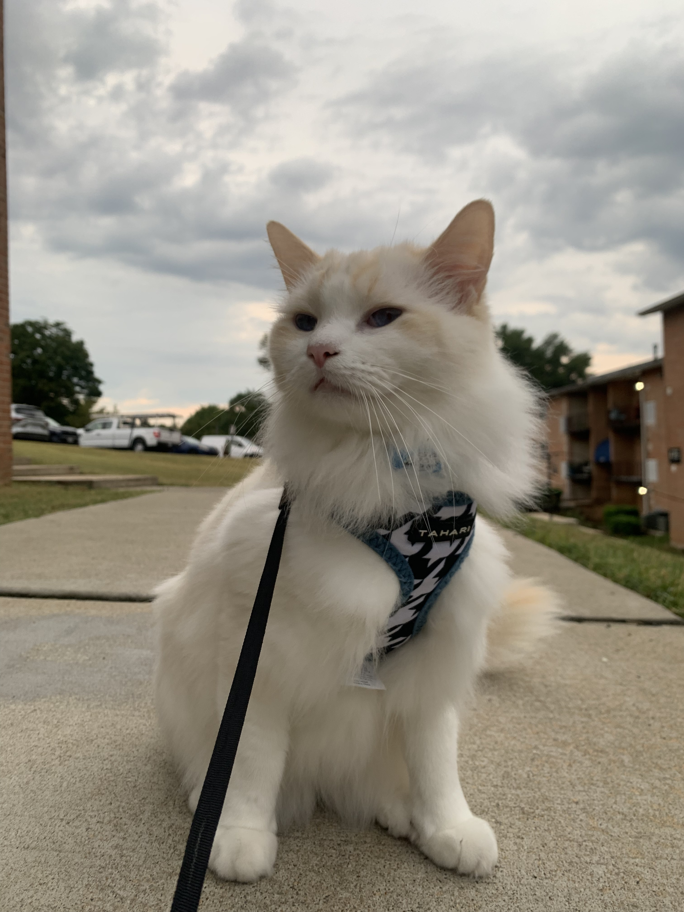

  <h1>Hi there, I'm Shu Wang! 👋</h1>
  
   

    <strong>Software Developer Apprentice @ PlayStation</strong> 
    M.S. Computer Science Student @ Georgia Tech
  

  

    I work on Java/Spring backend services and automated payment testing. 
    With a background in bioinformatics and data analysis, I enjoy turning complex problems into useful software.
  

  

    
    
    
  

---
### 💼 What I'm Working On

**Sony Interactive Entertainment · PlayStation**  
Software Developer Apprentice — Payments | August 2026–Present

- Authored **74 automated payment test scenarios for South Korea** as part of a multi-country testing initiative, covering card, wallet, and local payment methods across purchase, refund, and entitlement flows.
- Investigate payment failures through API responses and transaction records, identifying issues with wallet funding, subscription eligibility, and payment-provider routing.
- Develop a feature-flagged proof of concept integrating the Payment Method Service with a data access library, including service branching, response mapping, and unit tests.
- Contribute to Java/Spring service maintenance through dependency remediation and Jenkins integration-test troubleshooting.

### 🌱 My Background
- **Georgia Tech:** Pursuing an M.S. in Computer Science, expected 2027.
- **Techtonica:** 2026 cohort, with hands-on full-stack development training and a sponsored apprenticeship at PlayStation.
- **Research & data:** Background in bioinformatics, analytical workflows, and reproducible data processing.

### 🛠️ Languages & Tools

| Area                | Technologies                                                       |
| :------------------ | :----------------------------------------------------------------- |
| Languages           | Java, Python, JavaScript, TypeScript, SQL, R                       |
| Backend             | Spring Boot, Node.js, Express, Flask, REST APIs                    |
| Frontend            | React, HTML, CSS                                                   |
| Databases & Caching | PostgreSQL, MySQL, Oracle, Redis                                   |
| Cloud & Delivery    | AWS, Docker, Jenkins, Git, Linux                                   |
| Testing             | Jest, unit testing, integration testing, automated payment testing |

---
### 🚀 Featured Projects

#### CaseForge — Research Impact Dashboard

A full-stack dashboard that brings publication imports, citation analytics, and AI-assisted summaries into one workflow, connecting my research background with software engineering.

- Background workers collect and process citation data.
- Authenticated users manage projects and saved analytics.
- Includes Docker configuration and automated frontend/backend tests.

**Tech:** TypeScript · React · PostgreSQL · BullMQ · Redis

[Source Code](https://github.com/shuwangs/CaseForge) · [Watch Demo](https://youtu.be/CCA1onFAI0g)

*Citation fetching runs locally; the hosted version currently lacks the background worker.*

#### Eventonica — Event Management Platform

A full-stack application for browsing, searching, filtering, and favoriting events, with event creation and management features.

**Tech:** React · Node.js · Express · PostgreSQL · REST APIs

[Source Code](https://github.com/shuwangs/eventonica)

#### QuizCraft — AI-Assisted Trivia App

A trivia application that fetches questions from the Open Trivia Database API, tracks incorrect answers, and provides AI-generated explanations.

**Tech:** React · Node.js · Express · Jest · LLM Integration

[Live Demo](https://trivia-game-app.vercel.app/) · [Source Code](https://github.com/shuwangs/techtonica-assignments/tree/main/projects/trivia_app)

#### Full-Stack Weather App

A weather application supporting city and geolocation searches, with Redis caching and a UI that distinguishes cached data from fresh results.

**Tech:** React · Node.js · Express · Redis · REST APIs

[Source Code](https://github.com/shuwangs/techtonica-assignments/tree/main/projects/weather-app)

#### Job Offer Comparison App

An Android application for comparing job offers using compensation, benefits, and user-defined preferences.

**Tech:** Java · Object-Oriented Design · Android Studio

[Source Code](https://github.com/shuwangs/cs6300/tree/main/GroupProject/JobCompare6300)

**More projects:** [Explore my portfolio →](https://shu-su-wang.vercel.app/projects)

---

### ✍️ Learning & Building

I write about software concepts, project decisions, and lessons from debugging.

[Read my blog →](https://shu-su-wang.vercel.app/blog)

---

### 🐱 Meet My Pair Programmer

  
  

    This is <strong>Bobo</strong>, my unofficial pair programmer. 
    His specialties include keyboard inspections and debugging supervision. 🐾
  

---

> 💛 Thanks for stopping by! Feel free to explore my projects or connect with me.
